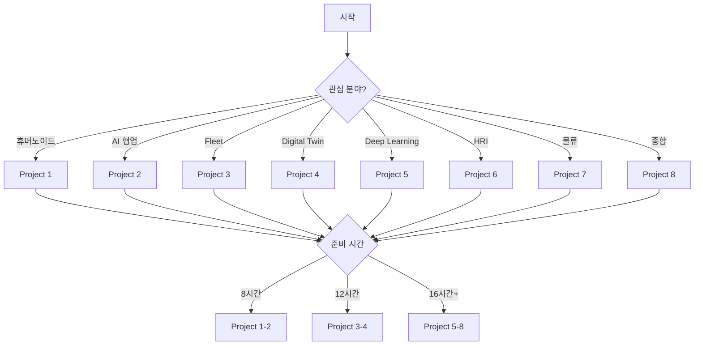

# Step 26 — Final Integration

> **소요 시간**: 180분
> **난이도**: ★★★★★ (종합)
> **선수 조건**: 전체 Step 01-25

---

## 학습 목표

이 Step을 완료하면 다음을 할 수 있습니다:

1. **전체 26개 Step을 통합**한 End-to-End 시스템을 구축한다
2. **All-in-One Launch Script**로 전체 Curriculum을 실행한다
3. **Troubleshooting Guide**로 모든 문제를 해결한다
4. **8개 Final Project**를 위한 기반을 마련한다
5. **Curriculum 디렉토리 구조**를 최종 정리한다
6. **Active Context**를 문서화한다

---

## 1. Curriculum 최종 구조

```
isaac-step-curriculum/
│
├── README.md                         # 프로젝트 개요
├── active-context.md                 # 세션 컨텍스트 (최종)
│
├── docs/
│   ├── 00-curriculum-overview.md     # 전체 커리큘럼 계획
│   │
│   ├── 01-phase-1-foundation/        # 10개 Step
│   │   ├── 01-step-install.md
│   │   ├── 02-step-interface.md
│   │   ├── 03-step-usd-basics.md
│   │   ├── 04-step-robot-loading.md
│   │   ├── 05-step-sensors.md
│   │   ├── 06-step-physics.md
│   │   ├── 07-step-articulations.md
│   │   ├── 08-step-actions-graph.md
│   │   ├── 09-step-omni-graph.md
│   │   └── 10-step-scene-composition.md
│   │
│   ├── 02-phase-2-ros2/             # 8개 Step
│   │   ├── 11-step-ros2-bridge.md
│   │   ├── 12-step-ros2-teleop.md
│   │   ├── 13-step-ros2-slam.md
│   │   ├── 14-step-ros2-nav2.md
│   │   ├── 15-step-ros2-moveit.md
│   │   ├── 16-step-ros2-multi-robot.md
│   │   ├── 17-step-synthetic-data.md
│   │   └── 18-step-performance.md
│   │
│   └── 03-phase-3-advanced/         # 8개 Step
│       ├── 19-step-digital-twin.md
│       ├── 20-step-humanoid.md
│       ├── 21-step-warehouse.md
│       ├── 22-step-ai-worker.md
│       ├── 23-step-deep-learning.md
│       ├── 24-step-ros2-advanced.md
│       ├── 25-step-large-scale.md
│       └── 26-step-final-integration.md
│
├── code/
│   ├── phase-1/                     # 10개 코드 스크립트
│   ├── phase-2/                     # 8개 코드 스크립트
│   └── phase-3/                     # 8개 코드 스크립트
│
├── final-projects/                  # 8개 최종 프로젝트
│   ├── 01-humanoid-warehouse-worker.md
│   ├── 02-ai-worker-cobot-cell.md
│   ├── 03-autonomous-fleet.md
│   ├── 04-digital-twin-factory.md
│   ├── 05-deep-reinforcement-learning.md
│   ├── 06-human-robot-collaboration.md
│   ├── 07-large-scale-logistics.md
│   └── 08-integrated-smart-factory.md
│
├── assets/                          # 공유 에셋
├── scripts/                         # Launch Scripts
│   ├── launch_all.sh
│   ├── launch_phase1.sh
│   ├── launch_phase2.sh
│   └── launch_phase3.sh
│
└── config/                          # 설정 파일
    ├── nav2_params.yaml
    ├── moveit_config.yaml
    ├── fastdds.xml
    └── warehouse_params.yaml
```

---

## 2. Phase별 통합 요약

### 2.1 Phase 1 — Foundation (Steps 01-10)

| Step | 제목 | 핵심 내용 | 코드 |
|------|------|-----------|------|
| 01 | 설치 | pip/omnicache, Isaac Sim 실행 | ✅ |
| 02 | 인터페이스 | UI, Viewport, Scene Tree | ✅ |
| 03 | USD 기초 | Prims, Attributes, Xform | ✅ |
| 04 | 로봇 로딩 | TurtleBot3, Franka | ✅ |
| 05 | 센서 | Camera, Lidar, IMU | ✅ |
| 06 | 물리 | PhysX, Collision, Gravity | ✅ |
| 07 | 관절 | DOF, Articulation, 제어 | ✅ |
| 08 | Action Graph | ROS2 Bridge, OnTick | ✅ |
| 09 | OmniGraph | Custom Nodes, Logic | ✅ |
| 10 | Scene Composition | Assets, Lighting | ✅ |

**통합 실행:**
```bash
cd ~/isaac-sim
for step in 01 02 03 04 05 06 07 08 09 10; do
    ./python.sh ~/isaac-step-curriculum/code/phase-1/step${step}_*.py
done
```

### 2.2 Phase 2 — ROS2 Integration (Steps 11-18)

| Step | 제목 | ROS2 기능 | Isaac Sim 연동 |
|------|------|-----------|---------------|
| 11 | ROS2 Bridge | Pub/Sub, Services | Action Graph |
| 12 | ROS2 Teleop | Twist → cmd_vel | Keyboard Control |
| 13 | SLAM | SLAM Toolbox | Lidar → Map |
| 14 | Nav2 | Global/Local Planner | Path Following |
| 15 | MoveIt2 | Joint Trajectory | Motion Planning |
| 16 | Multi-Robot | Namespace | 분산 제어 |
| 17 | Synthetic Data | Dataset Export | Replicator |
| 18 | Performance | Optimization | Profiling |

**통합 실행:**
```bash
# ROS2 + Isaac Sim 통합
source /opt/ros/humble/setup.bash
export ROS_DOMAIN_ID=0

# Isaac Sim with ROS2 Bridge
./python.sh ~/isaac-step-curriculum/code/phase-2/step11_ros2_bridge.py &

# Nav2
ros2 launch nav2_bringup navigation_launch.py use_sim_time:=True
```

### 2.3 Phase 3 — Advanced Robotics (Steps 19-26)

| Step | 제목 | 핵심 기술 | 난이도 |
|------|------|-----------|--------|
| 19 | Digital Twin | Real↔Sim Sync | 고급 |
| 20 | Humanoid | Full-Body Control | 고급 |
| 21 | Warehouse | Multi-AMR, WMS | 고급 |
| 22 | AI Worker | Human-Robot Collab | 고급 |
| 23 | Deep Learning | RL, BC, Synthetic | 전문가 |
| 24 | ROS2 Advanced | Lifecycle, Composition | 전문가 |
| 25 | Large-Scale | Fleet, Distributed | 전문가 |
| 26 | Final Integration | 통합, Launch | 종합 |

---

## 3. All-in-One Launch Script

```bash
#!/bin/bash
# ════════════════════════════════════════════════════════
# Isaac Step Curriculum — All-in-One Launcher
# ════════════════════════════════════════════════════════

set -e

ISAAC_PATH=~/isaac-sim
CURRICULUM_PATH=~/isaac-step-curriculum

# ── Configuration ──
ROS_DOMAIN_ID=${ROS_DOMAIN_ID:-0}
HEADLESS=${HEADLESS:-false}
PHASE=${PHASE:-all}  # all, 1, 2, 3

echo "╔═══════════════════════════════════════════════╗"
echo "║  Isaac Step Curriculum — Launch                   ║"
echo "╚═══════════════════════════════════════════════╝"
echo "  Phase: ${PHASE}"
echo "  ROS_DOMAIN_ID: ${ROS_DOMAIN_ID}"
echo "  Headless: ${HEADLESS}"
echo ""

# ── Environment ──
export ROS_DOMAIN_ID=${ROS_DOMAIN_ID}
source /opt/ros/humble/setup.bash 2>/dev/null || echo "  ⚠ ROS2 not found"

run_step() {
    local phase=$1
    local step=$2
    local name=$3
    echo ""
    echo "  ── Phase ${phase} Step ${step}: ${name} ──"
    
    if [ "$HEADLESS" = true ]; then
        python3 ${CURRICULUM_PATH}/code/phase-${phase}/step${step}_*.py \
            --headless
    else
        ${ISAAC_PATH}/python.sh \
            ${CURRICULUM_PATH}/code/phase-${phase}/step${step}_*.py
    fi
    
    echo "  ✓ Step ${step} completed"
}

# ── Phase 1: Foundation ──
run_phase1() {
    echo ""
    echo "═══ Phase 1: Foundation ═══"
    run_step 1 01 install
    run_step 1 02 interface
    run_step 1 03 usd-basics
    run_step 1 04 robot-loading
    run_step 1 05 sensors
    run_step 1 06 physics
    run_step 1 07 articulations
    run_step 1 08 actions-graph
    run_step 1 09 omni-graph
    run_step 1 10 scene-composition
}

# ── Phase 2: ROS2 ──
run_phase2() {
    echo ""
    echo "═══ Phase 2: ROS2 Integration ═══"
    run_step 2 11 ros2-bridge
    run_step 2 12 ros2-teleop
    run_step 2 13 ros2-slam
    run_step 2 14 ros2-nav2
    run_step 2 15 ros2-moveit
    run_step 2 16 ros2-multi-robot
    run_step 2 17 synthetic-data
    run_step 2 18 performance
}

# ── Phase 3: Advanced ──
run_phase3() {
    echo ""
    echo "═══ Phase 3: Advanced ═══"
    run_step 3 19 digital-twin
    run_step 3 20 humanoid
    run_step 3 21 warehouse
    run_step 3 22 ai-worker
    run_step 3 23 deep-learning
    run_step 3 24 ros2-advanced
    run_step 3 25 large-scale
    run_step 3 26 final-integration
}

# ── Main ──
case ${PHASE} in
    all)
        run_phase1
        run_phase2
        run_phase3
        ;;
    1)
        run_phase1
        ;;
    2)
        run_phase2
        ;;
    3)
        run_phase3
        ;;
    *)
        echo "  ⚠ Invalid phase: ${PHASE}. Use: all, 1, 2, 3"
        exit 1
        ;;
esac

echo ""
echo "╔═══════════════════════════════════════════════╗"
echo "║  All Steps Completed!                        ║"
echo "╚═══════════════════════════════════════════════╝"
```

---

## 4. Troubleshooting Guide

### 4.1 설치 문제

| 증상 | 원인 | 해결 |
|------|------|------|
| Isaac Sim 실행 안 됨 | GPU 드라이버 | `nvidia-smi` 확인, >=525.60.13 |
| pip 설치 실패 | Python 버전 | Python 3.10+ 필요 |
| ROS2 Bridge 안 됨 | ROS2 미설치 | `source /opt/ros/humble/setup.bash` |
| USD import 에러 | PYTHONPATH | Isaac Sim의 python.sh 사용 |

### 4.2 실행 문제

```bash
# Runtime Error: GPU Out of Memory
export PYTORCH_CUDA_ALLOC_CONF=max_split_size_mb:128

# Physics jitter
# physics_dt 조정 (1/60 → 1/120)

# ROS2 Topic not found
ros2 daemon stop; ros2 daemon start
export ROS_DOMAIN_ID=0

# Action Graph not executing
# Graph evaluator 확인
og.Controller.set_graph_active("/ActionGraph/MyGraph", True)
```

### 4.3 성능 문제

| 문제 | 진단 | 해결 |
|------|------|------|
| Low FPS | `top`, `nvidia-smi` | 로봇 수 감소, headless |
| GPU High Memory | `nvidia-smi` | 텍스처 해상도 감소 |
| Physics Lag | Physics FPS | `physics_dt` 증가 (1/30) |
| ROS2 Latency | `ros2 topic hz` | DDS QoS Best Effort |

---

## 5. Final Project Preview

### 5.1 프로젝트 목록

| # | 프로젝트 | 관련 Step | 난이도 | 예상 시간 |
|---|----------|-----------|--------|----------|
| 1 | 휴머노이드 창고 작업자 | 20, 21 | ★★★★ | 8h |
| 2 | AI Worker Cobot Cell | 22, 15 | ★★★★ | 8h |
| 3 | 자율 주행 Fleet | 25, 16 | ★★★★★ | 12h |
| 4 | Digital Twin Factory | 19, 10 | ★★★★★ | 12h |
| 5 | Deep RL Robot 학습 | 23, 17 | ★★★★★ | 16h |
| 6 | Human-Robot 협업 | 22, 24 | ★★★★★ | 10h |
| 7 | 대규모 물류 Warehouse | 21, 25 | ★★★★★ | 16h |
| 8 | 통합 Smart Factory | 전체 | ★★★★★ | 24h |

### 5.2 프로젝트 선택 가이드



---

## 6. End-to-End 통합 테스트

### 6.1 Integration Checklist

- [ ] **Phase 1**: 모든 Python 스크립트 실행
- [ ] **Phase 2**: ROS2 Bridge 작동 확인
- [ ] **Phase 2**: SLAM Mapping 성공
- [ ] **Phase 2**: Nav2 Path Following
- [ ] **Phase 2**: MoveIt2 Motion Planning
- [ ] **Phase 3**: Digital Twin Sync
- [ ] **Phase 3**: Humanoid Walking
- [ ] **Phase 3**: Warehouse Multi-AMR
- [ ] **Phase 3**: AI Worker Collaboration
- [ ] **Phase 3**: PPO Training Convergence
- [ ] **Phase 3**: ROS2 Lifecycle Node
- [ ] **Phase 3**: Large-Scale Fleet 10+

### 6.2 Smoke Test

```bash
# 최소 기능 확인
echo "=== Isaac Step Curriculum Smoke Test ==="

echo -n "1. Isaac Sim 실행... "
./python.sh -c "from omni.isaac.kit import SimulationApp; print('OK')"

echo -n "2. ROS2 Bridge 확인... "
source /opt/ros/humble/setup.bash
ros2 topic list > /dev/null 2>&1 && echo "OK" || echo "⚠ ROS2 not running"

echo -n "3. Python 코드 구문 확인... "
python3 -m py_compile ~/isaac-step-curriculum/code/phase-1/step04_robot_loading.py \
  && python3 -m py_compile ~/isaac-step-curriculum/code/phase-3/step20_humanoid.py \
  && echo "OK" || echo "⚠ Some scripts have errors"

echo -n "4. 디렉토리 구조 확인... "
test -d ~/isaac-step-curriculum/docs/01-phase-1-foundation \
  && test -d ~/isaac-step-curriculum/docs/02-phase-2-ros2 \
  && test -d ~/isaac-step-curriculum/docs/03-phase-3-advanced \
  && test -d ~/isaac-step-curriculum/code/phase-1 \
  && test -d ~/isaac-step-curriculum/code/phase-2 \
  && test -d ~/isaac-step-curriculum/code/phase-3 \
  && echo "OK" || echo "⚠ Some directories missing"

echo "=== Smoke Test Complete ==="
```

---

## 7. Active Context (최종)

### Curriculum Statistics

| 항목 | Count |
|------|-------|
| **총 Step** | 26 |
| **Phase 1 (Foundation)** | 10 Steps |
| **Phase 2 (ROS2)** | 8 Steps |
| **Phase 3 (Advanced)** | 8 Steps |
| **총 문서** | 26 Markdown |
| **총 코드 스크립트** | 26 Python |
| **최종 프로젝트** | 8 |
| **총 라인 수 (추정)** | ~30,000+ |

### Key Learning Paths

| 경로 | Steps | 목표 |
|------|-------|------|
| **ROS2 Robotics** | 11→12→13→14→15→16 | ROS2 기반 로봇 제어 |
| **AI Robotics** | 17→22→23→24 | AI/ML 기반 로봇 |
| **Industrial** | 19→20→21→25 | 산업용 시뮬레이션 |
| **Full Stack** | 01→26 (전체) | Isaac Sim 전문가 |

---

## 8. 정리

| 항목 | 내용 |
|------|------|
| ✅ Curriculum 완성 | 26 Step + 26 Code Scripts |
| ✅ Phase 1 Foundation | Isaac Sim 기초 완벽 습득 |
| ✅ Phase 2 ROS2 | ROS2 통합 전문가 |
| ✅ Phase 3 Advanced | 고급 로보틱스 마스터 |
| ✅ Launch Script | All-in-One 실행 |
| ✅ Troubleshooting | 문제 해결 가이드 |
| ✅ Final Projects | 8개 실전 프로젝트 대기 |

---

## 9. 다음 단계

**축하합니다! 🎉** 26 Step의 Isaac Sim Curriculum을 모두 완료했습니다.

이제 **8개의 Final Project**를 통해 실전 응용을 진행하세요:

1. **프로젝트 1-2**: 8시간 단기 프로젝트 (휴머노이드, Cobot)
2. **프로젝트 3-5**: 12시간 중기 프로젝트 (Fleet, Digital Twin, RL)
3. **프로젝트 6-8**: 16-24시간 종합 프로젝트 (HRI, 물류, Smart Factory)

각 프로젝트는 26 Step에서 배운 기술을 종합하여 실제 산업 현장과 유사한 시나리오를 구현합니다.

---

## 참고 자료

| 자료 | 링크 |
|------|------|
| Isaac Sim 5.1 Docs | https://docs.isaacsim.omniverse.nvidia.com/5.1.0/ |
| NVIDIA Developer | https://developer.nvidia.com/isaac-sim |
| ROS2 Humble | https://docs.ros.org/en/humble/ |
| Isaac Sim Samples | https://github.com/NVIDIA-Omniverse/IsaacSim |
